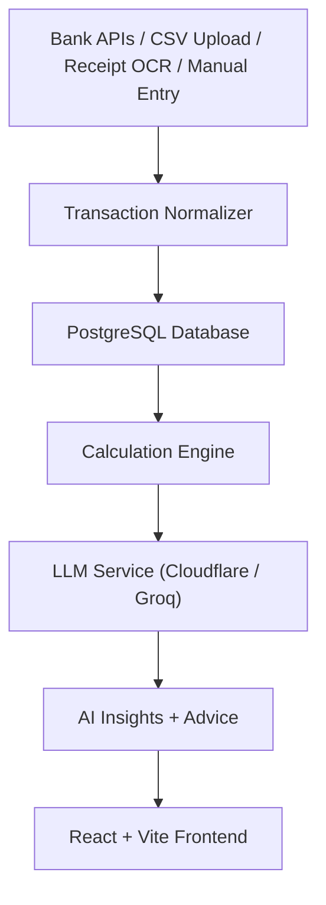

<div align="center">

# 💰 Nexpent

### AI-Powered Personal Finance Advisor

A full-stack financial management platform that combines **bank connectivity**, **receipt scanning**, **smart budgeting**, and **AI-driven insights** to help users take control of their money.

<p align="center">
  <a href="https://python.org">
    
  </a>
  <a href="https://fastapi.tiangolo.com">
    
  </a>
  <a href="https://react.dev">
    
  </a>
  <a href="https://vite.dev">
    
  </a>
  <a href="https://postgresql.org">
    
  </a>
</p>

</div>

---

# ✨ Features

| Feature | Description |
|---|---|
| 🏦 **Bank Integration** | Connect bank accounts via pluggable provider interfaces — no passwords stored |
| 🧾 **Receipt Scanning** | Upload receipts → PaddleOCR extracts text → LLM parses structured expenses |
| 📊 **Smart Dashboard** | Real-time overview of income, expenses, trends, and category breakdowns |
| 🤖 **AI Financial Advisor** | Chat with an AI that understands spending patterns and gives actionable advice |
| 📈 **Analytics & Trends** | Monthly summaries, category analysis, and spending trend forecasts |
| 💼 **Budget Management** | Create and track budgets by category with progress indicators |
| 🎯 **Savings Goals** | Set financial goals and monitor progress over time |
| 📒 **Transaction Ledger** | Full transaction history with CSV import, manual entry, and smart categorization |
| 🔄 **Recurring Detection** | Automatically identifies recurring transactions and subscriptions |
| 🔐 **Secure by Design** | Argon2 password hashing, encrypted tokens, audit logging, and JWT auth |

---

# 🏗️ Architecture



### Stack Overview

- **Backend** — FastAPI + SQLAlchemy + PostgreSQL with pluggable bank and OCR providers
- **Frontend** — React 18 + Vite + React Router with a responsive mobile-first UI
- **AI Layer** — Cloudflare Workers AI / Groq LLM for advice, categorization, and receipt parsing
- **Security** — JWT auth, encrypted provider tokens, audit logging
- **Financial calculations are always server-side** — the LLM never computes totals

---

# 🚀 Quick Start

## Prerequisites

- Python 3.10+
- Node.js 18+
- PostgreSQL *(SQLite supported for development)*
- Redis *(optional, for caching)*

---

## 1️⃣ Clone the Repository

```bash
git clone https://github.com/alfibi/nexpent.git
cd nexpent
```

---

## 2️⃣ Backend Setup

```bash
cd backend

python -m venv .venv

# Linux / macOS
source .venv/bin/activate

# Windows
.venv\Scripts\activate

pip install -r requirements.txt
```

Copy the environment template:

```bash
cp .env.example .env
```

<details>
<summary><strong>📋 Important Environment Variables</strong></summary>

| Variable | Description |
|---|---|
| `DATABASE_URL` | PostgreSQL connection string |
| `JWT_SECRET_KEY` | Secret used for JWT signing |
| `TOKEN_ENCRYPTION_KEY` | Fernet key for encrypting provider tokens |
| `CLOUDFLARE_LLM_ENDPOINT` | Cloudflare Workers AI endpoint |
| `CLOUDFLARE_LLM_API_KEY` | Cloudflare API key |
| `GROQ_API_KEY` | Groq API key *(alternative LLM provider)* |
| `REDIS_URL` | Redis connection string *(optional)* |

</details>

---

## 3️⃣ Frontend Setup

```bash
cd frontend
npm install
```

---

## 4️⃣ Run the Application

From the project root:

```bash
chmod +x run.sh
./run.sh
```

### Services

| Service | URL |
|---|---|
| Backend | http://localhost:8000 |
| Frontend | http://localhost:5173 |
| API Docs | http://localhost:8000/docs |

You can also run services individually:

```bash
./run.sh --backend
./run.sh --frontend
```

---

# 📁 Project Structure

```text
nexpent/
├── backend/
│   ├── main.py
│   ├── models.py
│   ├── config.py
│   ├── database.py
│   │
│   ├── routers/
│   │   ├── auth_api.py
│   │   ├── transactions.py
│   │   ├── receipts.py
│   │   ├── receipt_extraction.py
│   │   ├── banks.py
│   │   ├── budgets.py
│   │   ├── goals.py
│   │   ├── analytics_api.py
│   │   ├── ai.py
│   │   └── dashboard.py
│   │
│   ├── services/
│   │   ├── calculation_service.py
│   │   ├── cloudflareLLMService.py
│   │   ├── encryption_service.py
│   │   └── audit_service.py
│   │
│   ├── providers/
│   │   ├── banking/
│   │   └── ocr/
│   │
│   ├── middleware/
│   └── requirements.txt
│
├── frontend/
│   ├── src/
│   │   ├── App.jsx
│   │   ├── pages/
│   │   ├── components/
│   │   ├── contexts/
│   │   ├── lib/
│   │   └── styles.css
│   │
│   ├── package.json
│   └── vite.config.js
│
├── docs/
│   ├── architecture.md
│   ├── api.md
│   ├── database.md
│   └── security.md
│
├── run.sh
└── AGENTS.md
```

---

# 🔌 API Overview

All endpoints are available under `/api`.

| Module | Endpoints |
|---|---|
| **Auth** | `POST /api/auth/register` · `POST /api/auth/login` · `POST /api/auth/logout` · `GET /api/auth/me` |
| **Transactions** | `GET /api/transactions` · `POST /api/transactions` · `POST /api/transactions/import-csv` |
| **Receipts** | `POST /api/receipts/upload` · `POST /extract-receipt` |
| **Banks** | `POST /api/banks/connect` · `GET /api/banks/accounts` · `POST /api/banks/sync` |
| **Budgets** | `POST /api/budgets` · `GET /api/budgets` · `PUT /api/budgets/{id}` |
| **Goals** | `POST /api/goals` · `GET /api/goals` · `PUT /api/goals/{id}` |
| **Analytics** | `GET /api/analytics/monthly-summary` · `GET /api/analytics/category-spending` · `GET /api/analytics/trends` |
| **AI** | `POST /api/ai/chat` · `POST /api/ai/analyze-spending` · `GET /api/ai/insights` |

---

# 🧪 Testing

## Backend Tests

```bash
PYTHONPATH=backend pytest backend/tests
```

## Backend Syntax Check

```bash
python -m compileall backend
```

## Frontend Lint

```bash
cd frontend
npm run lint
```

## Frontend Production Build

```bash
cd frontend
npm run build
```

---

# 🔒 Security

- **Argon2** password hashing via Passlib
- **HTTP-only cookies** + Bearer JWT authentication
- **Encrypted provider tokens** using Fernet
- **Pydantic validation** on all API requests
- **Strict ownership enforcement** for financial data
- **Audit logging** for important financial actions
- **LLM isolation** — credentials are never shared with AI services
- **Configurable rate limiting** through middleware

---

# 📄 License

This project is open source. See the repository for license details.

---

<div align="center">

### Built with ❤️ for smarter personal finance

</div>
