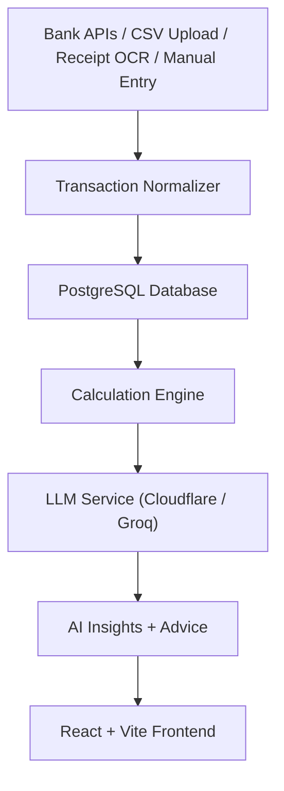

<](https://python.org)
[](https://fastapi.tiangolo.com)
[](https://react.dev)
[](https://vite.dev)
[](https://postgresql.org)

</div>

---

## ✨ Features

| Feature | Description |
|---|---|
| 🏦 **Bank Integration** | Connect bank accounts via pluggable provider interface — no passwords stored |
| 🧾 **Receipt Scanning** | Upload receipts → PaddleOCR extracts text → LLM parses structured expenses |
| 📊 **Smart Dashboard** | Real-time overview of income, expenses, trends, and category breakdowns |
| 🤖 **AI Financial Advisor** | Chat with an AI that understands your spending patterns and gives actionable advice |
| 📈 **Analytics & Trends** | Monthly summaries, category spending analysis, and spending trend forecasts |
| 💼 **Budget Management** | Create and track budgets by category with progress indicators |
| 🎯 **Savings Goals** | Set financial goals and monitor progress over time |
| 📒 **Transaction Ledger** | Full transaction history with CSV import, manual entry, and smart categorization |
| 🔄 **Recurring Detection** | Automatically identifies recurring transactions and subscriptions |
| 🔐 **Secure by Design** | Argon2 password hashing, encrypted tokens, audit logging, JWT auth |

---

## 🏗️ Architecture



- **Backend** — FastAPI + SQLAlchemy + PostgreSQL with pluggable bank and OCR providers
- **Frontend** — React 18 + Vite + React Router with a responsive mobile-first UI
- **AI** — Cloudflare Workers AI / Groq LLM for advice, categorization, and receipt parsing
- **Financial calculations are always server-side** — the LLM never computes totals

---

## 🚀 Quick Start

### Prerequisites

- Python 3.10+
- Node.js 18+
- PostgreSQL (or SQLite for development)
- Redis *(optional, for caching)*

### 1. Clone the repository

```bash
git clone https://github.com/alfibi/nexpent.git
cd nexpent
```

### 2. Backend setup

```bash
cd backend
python -m venv .venv
source .venv/bin/activate   # Windows: .venv\Scripts\activate
pip install -r requirements.txt
```

Copy the example environment file and fill in your values:

```bash
cp .env.example .env
```

<details>
<summary>📋 Key environment variables</summary>

| Variable | Description |
|---|---|
| `DATABASE_URL` | PostgreSQL connection string |
| `JWT_SECRET_KEY` | Secret for signing JWTs |
| `TOKEN_ENCRYPTION_KEY` | Fernet key for encrypting provider tokens |
| `CLOUDFLARE_LLM_ENDPOINT` | Cloudflare Workers AI endpoint |
| `CLOUDFLARE_LLM_API_KEY` | Cloudflare API key |
| `GROQ_API_KEY` | Groq API key (alternative LLM) |
| `REDIS_URL` | Redis connection string *(optional)* |

</details>

### 3. Frontend setup

```bash
cd frontend
npm install
```

### 4. Run everything

From the project root:

```bash
chmod +x run.sh
./run.sh
```

This starts both servers with a single command:
- **Backend** → `http://localhost:8000`
- **Frontend** → `http://localhost:5173`

You can also run them individually:

```bash
./run.sh --backend    # backend only
./run.sh --frontend   # frontend only
```

---

## 📁 Project Structure

```
nexpent/
├── backend/
│   ├── main.py                  # FastAPI application entry point
│   ├── models.py                # SQLAlchemy ORM models
│   ├── config.py                # App configuration
│   ├── database.py              # Database connection setup
│   ├── routers/
│   │   ├── auth_api.py          # Registration, login, logout
│   │   ├── transactions.py      # CRUD + CSV import
│   │   ├── receipts.py          # Receipt upload & management
│   │   ├── receipt_extraction.py # OCR → LLM pipeline
│   │   ├── banks.py             # Bank account connections
│   │   ├── budgets.py           # Budget management
│   │   ├── goals.py             # Savings goals
│   │   ├── analytics_api.py     # Spending analytics
│   │   ├── ai.py                # AI chat & insights
│   │   ├── dashboard.py         # Dashboard data aggregation
│   │   └── ...
│   ├── services/
│   │   ├── calculation_service.py   # Exact financial math
│   │   ├── cloudflareLLMService.py  # LLM integration
│   │   ├── encryption_service.py    # Token encryption
│   │   └── audit_service.py         # Audit logging
│   ├── providers/
│   │   ├── banking/             # Bank provider interface + mocks
│   │   └── ocr/                 # OCR provider interface + mocks
│   ├── middleware/               # Security headers, rate limiting
│   └── requirements.txt
├── frontend/
│   ├── src/
│   │   ├── App.jsx              # Root component & routing
│   │   ├── pages/
│   │   │   ├── Dashboard.jsx    # Main dashboard
│   │   │   ├── Ledger.jsx       # Transaction ledger
│   │   │   ├── Planner.jsx      # Budget planner
│   │   │   ├── Advisor.jsx      # AI advisor chat
│   │   │   ├── Goals.jsx        # Savings goals
│   │   │   ├── Accounts.jsx     # Bank accounts
│   │   │   ├── Profile.jsx      # User profile
│   │   │   └── Auth.jsx         # Login / Register
│   │   ├── components/          # Reusable UI components
│   │   ├── contexts/            # React context providers
│   │   ├── lib/                 # Utility functions
│   │   └── styles.css           # Global styles
│   ├── package.json
│   └── vite.config.js
├── docs/
│   ├── architecture.md
│   ├── api.md
│   ├── database.md
│   └── security.md
├── run.sh                       # One-command dev launcher
└── AGENTS.md                    # AI agent development guide
```

---

## 🔌 API Overview

All primary endpoints live under `/api`. Full reference in [`docs/api.md`](docs/api.md).

| Module | Endpoints |
|---|---|
| **Auth** | `POST /api/auth/register` · `POST /api/auth/login` · `POST /api/auth/logout` · `GET /api/auth/me` |
| **Transactions** | `GET /api/transactions` · `POST /api/transactions` · `POST /api/transactions/import-csv` |
| **Receipts** | `POST /api/receipts/upload` · `POST /extract-receipt` (OCR → LLM pipeline) |
| **Banks** | `POST /api/banks/connect` · `GET /api/banks/accounts` · `POST /api/banks/sync` |
| **Budgets** | `POST /api/budgets` · `GET /api/budgets` · `PUT /api/budgets/{id}` |
| **Goals** | `POST /api/goals` · `GET /api/goals` · `PUT /api/goals/{id}` |
| **Analytics** | `GET /api/analytics/monthly-summary` · `GET /api/analytics/category-spending` · `GET /api/analytics/trends` |
| **AI** | `POST /api/ai/chat` · `POST /api/ai/analyze-spending` · `GET /api/ai/insights` |

Interactive API docs available at `http://localhost:8000/docs` when running locally.

---

## 🧪 Testing

```bash
# Backend tests
PYTHONPATH=backend pytest backend/tests

# Backend syntax check
python -m compileall backend

# Frontend lint
cd frontend && npm run lint

# Frontend production build
cd frontend && npm run build
```

---

## 🔒 Security

- **Passwords** — Argon2 hashing via Passlib
- **Authentication** — HTTP-only cookies + Bearer JWT tokens
- **Provider tokens** — Encrypted at rest with Fernet (`TOKEN_ENCRYPTION_KEY`)
- **Request validation** — Pydantic models on all endpoints
- **Ownership enforcement** — Every query filters by authenticated user
- **Audit logging** — Important financial actions are logged
- **LLM isolation** — Only financial summaries sent to AI, never credentials
- **Rate limiting** — Configurable per-minute limits via middleware

---

## 📄 License

This project is open source. See the repository for license details.

---

<div align="center">

**Built with ❤️ for smarter personal finance**

</div>
]]>
