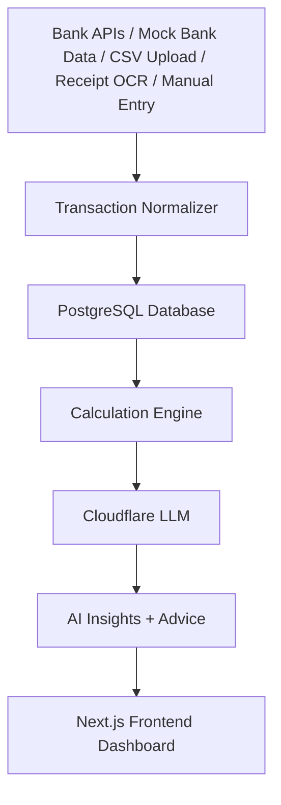

# Architecture

MoneyHub is a FastAPI + Next.js personal financial advisor app.

The backend preserves legacy income and expense tables while adding a unified `transactions` table for production financial-advisor workflows. Bank providers and OCR providers are pluggable interfaces with mock implementations for credential-free development.

Exact calculations are implemented in `backend/services/calculation_service.py`. The Cloudflare LLM is used only for summaries, advice, categorization support, receipt interpretation after OCR, and chat.
